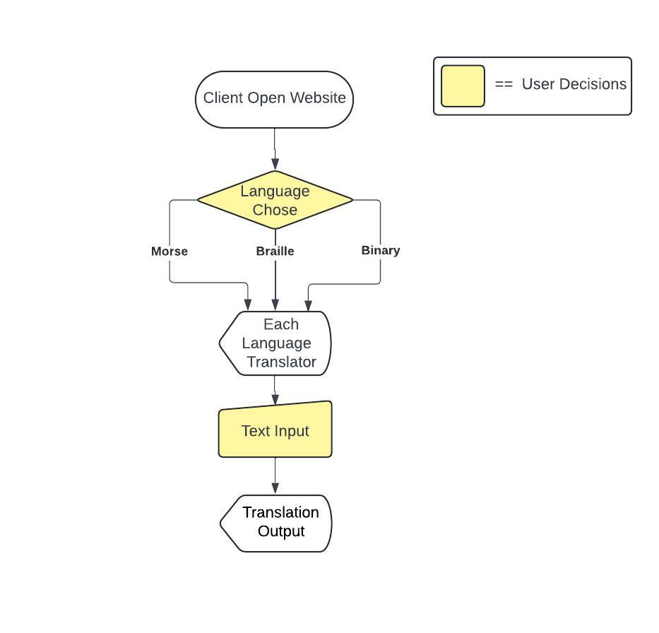
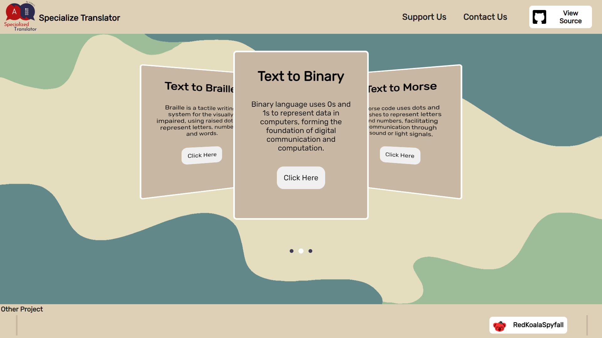
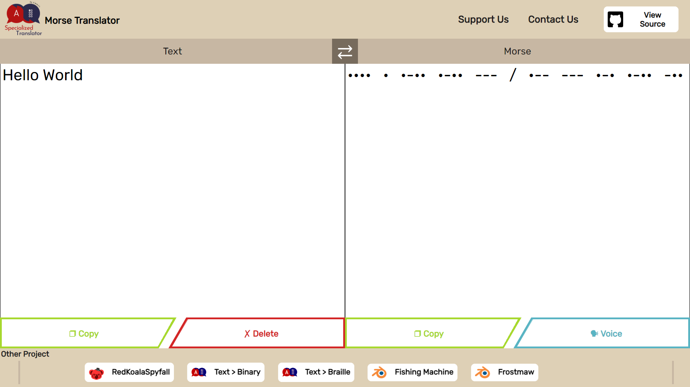
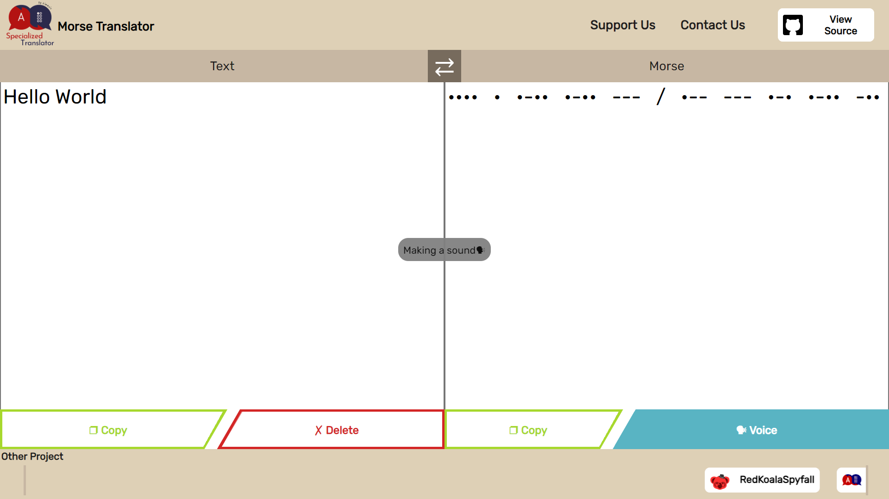
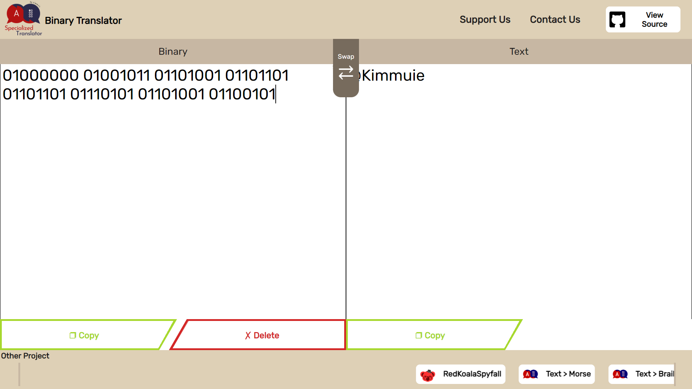

# SPTranslator

### What is SPTranslator?
**SPTranslator** stands for Specialized Translator, it is a tool that can convert Braille, Morse code, and binary into normal text. There are a few functions for instance, the Sound function can be used to read Morse code as a sound. Also this project was created because I have a lot of free time and I was thinking of an easy website to create, so I created this when I was in grade 12 as a hobby.
   
**SPTranslator** ย่อมาจาก Specialized Tranlanstor หากแปลเป็นไทยก็จะได้ว่า"เครื่องแปลภาษาเฉพาะทาง" ซึ่งเป็นเครื่องมือที่สามารถแปลง อักษรเบรลล์,รหัสมอร์ส และไบนารี่ให้เป็นขภาษาอังกฤษ โดยมีฟังก์ชันบางอัน เช่น ฟังก์ชันเสียงที่ใช้อ่านรหัสมอร์สเป็นเสียงได้ นอกจากนี้โปรเจ็กต์นี้สร้างขึ้นเนื่องจากผมมีเวลาว่างค่อนข้างมากและกำลังคิดจะสร้างเว็บไซต์ง่ายๆ ผมจึงสร้างเว็บนี้ขึ้นตอนอยู่ชั้นมัธยมศึกษาปีที่ 6 เป็นงานอดิเรกครับผม😊
 
 
 
### Method
In first sight of the website, there are 3 languages to use, after choosing, you will navigate to the translator interface. There are 2 sides, on the left is the text that you want to translate, and on the right will be the output of the left side. Both of them can swap by clicking the swap button that is between them. For Morse code, it is special because I add the function that is called "Sound" It is able to read the Morse code with short sound and long sound.
   
เมื่อเปิดเว็บไซต์ขึ้นมาจะเจอภาษาให้เลือก 3 ภาษา โดยเมื่อเลือกภาษาได้แล้วก็จะเข้าสู่หน้าสำหรับแปลภาษาทันที ซึ่งจะมี 2 ฝั่ง โดยที่ฝั่งซ้ายจะเป็นข้อความที่ต้องการแปล และฝั่งขวาจะเป็นผลลัพธ์ของฝั่งซ้าย โดยสามารถสลับภาษาได้ด้วยการคลิกปุ่มสลับที่อยู่ระหว่างทั้งสองฝั่ง สำหรับรหัส Morse นั้นมีความพิเศษตรงที่ผมได้เพิ่มฟังก์ชั่นที่เรียกว่า "Sound" เข้าไป โดยที่มันสามารถอ่านรหัส Morse ได้ทั้งเสียงสั้นและเสียงยาวตามข้อความที่แปล
 
 
 

### Used Language/Tools

  &nbsp;
  &nbsp;
  &nbsp;

   

This website is responsive. You can [Click Here](https://kimmuie.github.io/SPTranslator/) to use SPTranslator

### Flowchart 

  

   

### Website Interface

  
  
  
  

